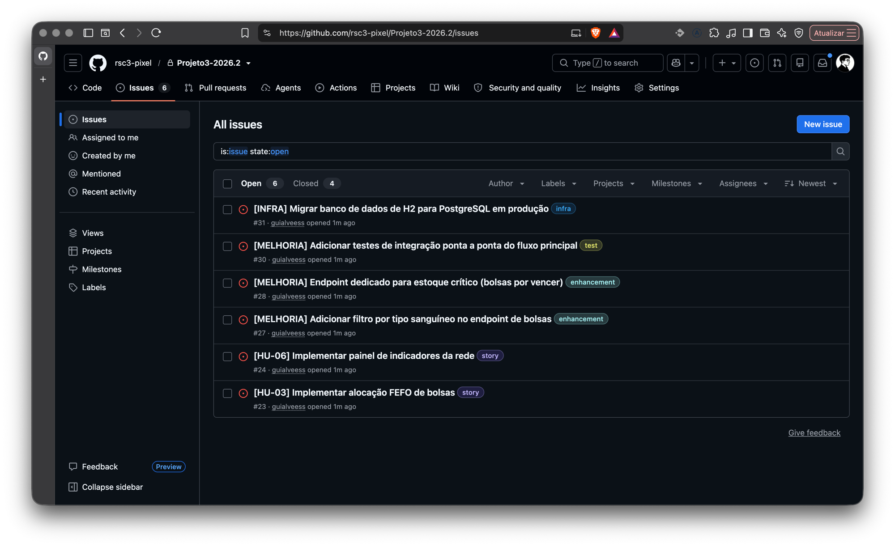

# Rota Vital

Plataforma web para distribuição de hemocomponentes: gestão de estoque, alocação de bolsas
compatíveis e roteirização respeitando cadeia fria e janelas de tempo.

## Descrição do projeto

A rede de sangue precisa garantir o componente certo (compatível e dentro da validade), no
lugar certo, no tempo certo e na temperatura certa. Falhas geram desabastecimento, descarte
por vencimento e risco ao paciente. Hoje falta uma plataforma que integre estoque,
compatibilidade e roteirização em um só lugar.

O Rota Vital é uma aplicação web que:

- gerencia o estoque de hemocomponentes;
- recebe requisições hospitalares;
- aloca bolsas compatíveis priorizando validade;
- calcula rotas de distribuição respeitando cadeia fria e janelas de tempo;
- apresenta painéis de indicadores de estoque/demanda e de monitoramento de temperatura.

### Competências trabalhadas

POO e Spring Boot; grafos e caminhos mínimos; matching de compatibilidade; filas de
prioridade e hash; estatística descritiva e probabilidade aplicadas; concorrência; CI/CD e
nuvem; arquitetura de redes e telemetria; trabalho em equipe.

### Limites e cuidados

- Apenas dados sintéticos, sem informações reais de doadores ou pacientes (LGPD).
- A telemetria de temperatura/GPS é simulada.
- A compatibilidade ABO/Rh é didática e não substitui protocolo clínico.

## Tecnologias usadas

| Camada | Tecnologia |
|---|---|
| Linguagem | Java 21 (LTS) |
| Framework web | Spring Boot 4.1.1 |
| Build | Maven, via wrapper (`mvnw`) |
| Persistência | Spring Data JPA / Hibernate |
| Banco de dados | H2 em memória (desenvolvimento) · PostgreSQL previsto para a Entrega 02 |
| Front-end | React (a implementar) |
| Testes | JUnit 5 |
| Integração contínua | GitHub Actions |
| Análise de dados | Python 3 (biblioteca padrão) |
| Prototipação | Figma |
| Diagramas | draw.io |
| Controle de versão | Git / GitHub |

## Entregas

### Entrega 01

**Status:** entregue em 31/08/2026

**Artefatos**

| Artefato | Link |
|---|---|
| Histórias de usuário com cenários BDD | [docs/historias-de-usuario.md](docs/historias-de-usuario.md) |
| Protótipo Lo-Fi (Figma) | [abrir protótipo](https://www.figma.com/make/FjQBa3isHRI4lxbASP8AEn/Dark-Web-Blood-Bank-Prototype?p=f&t=b0uZNhfKp6MHIZBO-0&fullscreen=1) |
| Screencast do protótipo | [assistir no YouTube](https://youtu.be/33CGLaHzz9A) |
| Modelo de domínio (diagrama de classes) | [dominio.png](dominio.png) · [dominio.drawio](dominio.drawio) |
| Contrato da API REST | [contrato_api.md](contrato_api.md) |
| Arquitetura de rede | [diagrama_arquitetura_redes.png](diagrama_arquitetura_redes.png) |
| Escopo do grafo de distribuição | [docs/escopo-grafo-rede-distribuicao.md](docs/escopo-grafo-rede-distribuicao.md) · [diagrama](docs/grafo-rede-distribuicao.png) |
| Estruturas de dados (grafo, FEFO, índice) | [docs/W04-estruturas-base.md](docs/W04-estruturas-base.md) |
| Complexidade das estruturas | [docs/complexidade-estruturas.md](docs/complexidade-estruturas.md) |
| Análise estatística (CRISP-DM) | [dados/crisp-dm-briefing.md](dados/crisp-dm-briefing.md) |
| Apresentação do pitch | [apresentacao/pitch-crisp-dm.html](apresentacao/pitch-crisp-dm.html) |

**Screenshots:** _(adicionar imagens do protótipo)_

### Entrega 02

**Status:** em andamento

**Artefatos**

| Artefato | Link |
|---|---|
| **Aplicação no ar** | [rsc3-rotavital.duckdns.org](https://rsc3-rotavital.duckdns.org/api/v1/hemocentros) |
| Pipeline e deploy | [docs/deploy.md](docs/deploy.md) |
| Histórias de usuário | [docs/historias-de-usuario.md](docs/historias-de-usuario.md) |
| Issue / Bug tracker | [github.com/…/issues](https://github.com/rsc3-pixel/Projeto3-2026.2/issues) |
| Screencast do sistema | _(a adicionar — YouTube)_ |
| Screencast do código | _(a adicionar — YouTube)_ |

#### Histórias implementadas

---

**HU-03 — Alocar bolsa priorizando validade (FEFO)**

| | |
|---|---|
| **Como** | técnico do hemocentro |
| **Quero** | que o sistema indique qual bolsa separar para cada item da requisição |
| **Para que** | eu use primeiro a que vence antes e reduza o descarte |

**Critérios de aceite:**
- Entre bolsas equivalentes, sempre sai a de validade mais próxima
- Bolsa vencida nunca entra na seleção
- Empate de validade resolvido de forma determinística
- Atendimento parcial é registrado, não tratado como falha

**Implementação:** `SelecaoFefo.java` (fila de prioridade FEFO) · `ServicoAlocacaoRota.java` · endpoint `POST /api/v1/requisicoes/{id}/itens/{itemId}/alocacoes`

---

**HU-06 — Acompanhar indicadores da rede**

| | |
|---|---|
| **Como** | coordenador da rede |
| **Quero** | ver estoque, descarte e cobertura de demanda por tipo sanguíneo |
| **Para que** | eu identifique onde falta sangue antes que vire desabastecimento |

**Critérios de aceite:**
- Indicadores calculados a partir do estoque real, não valores fixos
- Tipos com cobertura abaixo de 100% aparecem destacados
- Painel mostra medidas de dispersão, não só média
- Cada indicador exibe a unidade e o período considerado

**Implementação:** `IndicadorServico.java` · `IndicadorController.java` · endpoints `GET /api/v1/indicadores/*`

---

#### Issue / Bug tracker



**Screenshots:** _(a preencher — prints do sistema rodando)_

### Entrega 03

**Status:** não iniciada

**Artefatos:** _(a preencher)_

**Screenshots:** _(a preencher)_

### Entrega 04

**Status:** não iniciada

**Artefatos:** _(a preencher)_

**Screenshots:** _(a preencher)_

## Como rodar o projeto

### Pré-requisitos

- **JDK 21** (LTS). Confira com `java -version`.
- Não é preciso instalar o Maven: o projeto usa o Maven Wrapper (`mvnw`), que
  baixa a versão correta na primeira execução.

### Executando

```bash
# clonar o repositório
git clone https://github.com/rsc3-pixel/Projeto3-2026.2.git
cd Projeto3-2026.2

# Linux / macOS
./mvnw spring-boot:run

# Windows (PowerShell ou cmd)
.\mvnw.cmd spring-boot:run
```

A primeira execução baixa as dependências e demora alguns minutos. As
seguintes sobem em poucos segundos.

A aplicação fica disponível em `http://localhost:8080`.

### Aplicação em produção

A API está no ar, publicada automaticamente a cada push na `main`:

| URL | O que é |
|---|---|
| [`/actuator/health`](https://rsc3-rotavital.duckdns.org/actuator/health) | estado da aplicação |
| [`/api/v1/hemocentros`](https://rsc3-rotavital.duckdns.org/api/v1/hemocentros) | os hemocentros da carga inicial |
| [`/api/v1/bolsas`](https://rsc3-rotavital.duckdns.org/api/v1/bolsas) | o estoque |

Base: `https://rsc3-rotavital.duckdns.org`

O pipeline está em [.github/workflows/ci.yml](.github/workflows/ci.yml) e o
processo em [docs/deploy.md](docs/deploy.md).

### Endpoints disponíveis (execução local)

| URL | O que é |
|---|---|
| `http://localhost:8080/actuator/health` | Estado da aplicação (`{"status":"UP"}`) |
| `http://localhost:8080/h2-console` | Console do banco H2 |

Os endpoints de negócio seguem o [contrato_api.md](contrato_api.md):

| Recurso | Operações |
|---|---|
| `/api/v1/hemocentros` | GET, POST, PUT, DELETE; sub-recursos `/bolsas` e `/rotas` |
| `/api/v1/hospitais` | GET, POST, PUT, DELETE; sub-recurso `/requisicoes` |
| `/api/v1/bolsas` | GET, POST, PATCH (status), DELETE |
| `/api/v1/requisicoes` | GET, POST, PATCH (cancelamento); sub-recursos `/itens` e `/itens/{id}/alocacoes` |
| `/api/v1/rotas` | GET, POST, PATCH (status); sub-recurso `/bolsas` (embarque) |

Ao subir, a aplicação carrega dados sintéticos (4 hemocentros, 6 hospitais,
100 bolsas e requisições) para que a API já responda com conteúdo. A carga
está em `CargaInicial.java` e não roda no perfil de teste.

**Códigos de resposta:** 200/201/204 no caminho feliz, 400 para corpo
inválido (com os campos apontados), 404 para recurso inexistente e 409 quando
a operação fere uma regra de negócio (bolsa incompatível, transição de status
proibida, remoção de unidade com vínculos).

### Acessando o console do H2

Em `http://localhost:8080/h2-console`, preencha:

| Campo | Valor |
|---|---|
| JDBC URL | `jdbc:h2:mem:rotavital` |
| User Name | `sa` |
| Password | *(deixe em branco)* |

O banco é **em memória**: os dados existem enquanto a aplicação estiver
rodando e são perdidos ao parar. A migração para PostgreSQL está prevista para
a Entrega 02 e exige apenas trocar a URL e o driver em
`src/main/resources/application.properties`.

### Outros comandos

```bash
./mvnw clean compile   # compila
./mvnw test            # roda os testes
./mvnw clean package   # gera o jar em target/
```

### Rodando em modo produção

Para reproduzir localmente o que roda na VM:

```bash
./mvnw clean package -DskipTests
java -jar target/rota-vital-0.0.1-SNAPSHOT.jar --spring.profiles.active=prod
```

O perfil `prod` desliga o console do H2, restringe o Actuator ao `/health`,
tira o SQL do log e faz a aplicação escutar em `127.0.0.1:8081` — na VM ela
fica atrás do Nginx, servida em `/rota-vital/`. Ver
[application-prod.properties](src/main/resources/application-prod.properties)
e [docs/deploy.md](docs/deploy.md).

> Rodando localmente com o perfil `prod`, a aplicação responde em
> `http://localhost:8081`, não na 8080.

## Documentação técnica

Material de apoio, não exigido pelas entregas:

| Documento | O que cobre |
|---|---|
| [docs/entendendo-o-rota-vital.md](docs/entendendo-o-rota-vital.md) | guia comentado do código, do modelo de domínio ao deploy |

## Equipe

| Nome completo | E-mail da school |
|---|---|
| Cauã Rego Tavares Leite Duarte | crtld@cesar.school |
| Fernando Andrade Leandro Peixoto | falp2@cesar.school |
| Gabriel Brito Ferreira Dias | gbfd@cesar.school |
| Guilherme Alves de Souza | gas6@cesar.school |
| Lucas Ferreira Torres de Albuquerque | lfta@cesar.school |
| Maria Eduarda Vasconcelos | mevs@cesar.school |
| Renato Santos Chong | rsc3@cesar.school |
| Victor Barros Roma | vbr@cesar.school |


## Membros anteriores / novos

| Nome completo | E-mail da school | Entrada | Saída |
|---|---|---|---|
| _(nenhum até o momento)_ | | | |
